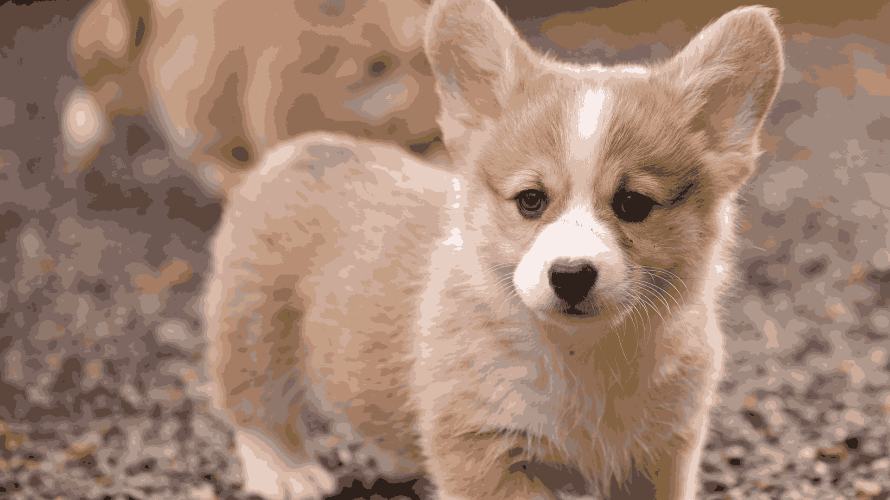
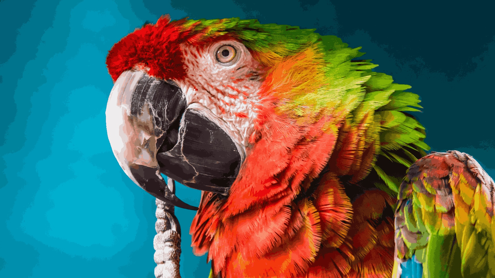
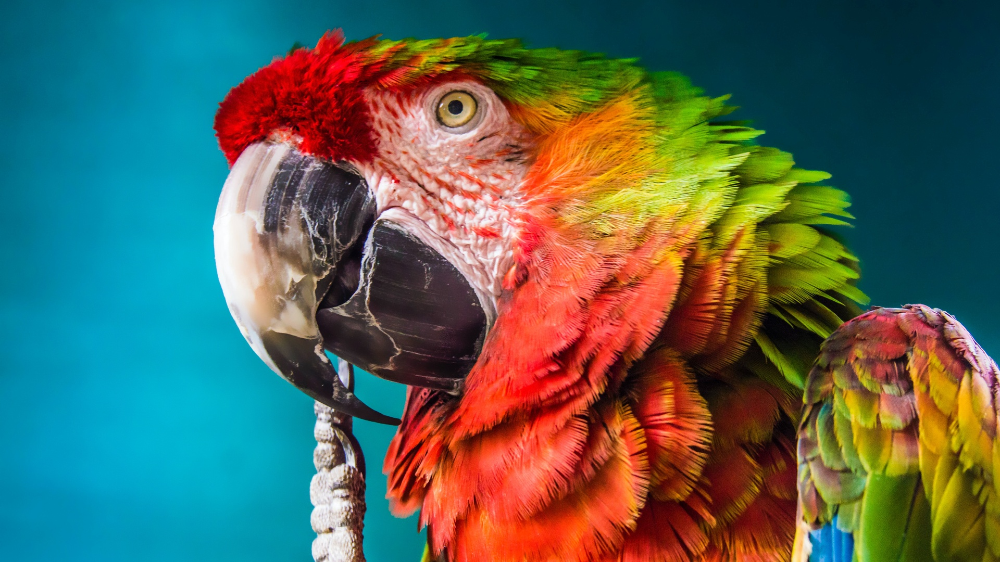
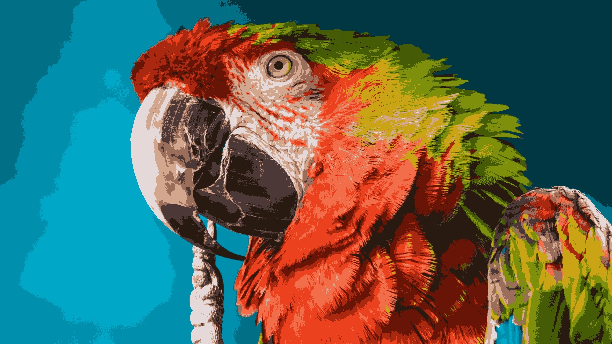

# 使用K-means算法进行图像压缩

K-means算法可以将原始图像的连续色彩值量化为有限个离散的代表性颜色值,从而实现图像的颜色量化。这在一定程度上牺牲了图像的精度,但大大减少了存储空间。

## 例1 柯基图像压缩

比如说，下边这张图是包含$1920×1080=2073600$个像素的彩色图像，每个像素由RGB三通道组成，每个通道的取值范围$[0,255]$，即每个通道占$1$个字节，所以每个像素使用$3$字节存储，则原始图像的存储空间约为$6MB$。


<p style="text-align: center;">原始1920×1080图像</p>

我们用K-means算法将这$200$万个像素点的颜色从24位聚类为16个代表性颜色，这样每个像素只需要4位（0.5字节）来表示颜色，总存储空间约为$1MB$，实现了6倍的图像压缩。

<div style="display: flex; justify-content: space-around;">
    <div>
        
        <p style="text-align: center;">原始图像</p>
    </div>
    <div>
        
        <p style="text-align: center;">16颜色的图像</p>
    </div>
</div>

如果是用64个颜色表示，则存储空间约为$1.5MB$，实现了4倍的图像压缩。

<div style="display: flex; justify-content: space-around;">
    <div>
        
        <p style="text-align: center;">原始图像</p>
    </div>
    <div>
        
        <p style="text-align: center;">64颜色的图像</p>
    </div>
</div>

## 例2 鹦鹉图像压缩

<div style="display: flex; justify-content: space-around;">
    <div>
        
        <p style="text-align: center;">64颜色的图像</p>
    </div>
    <div>
        
        <p style="text-align: center;">原始图像</p>
    </div>
    <div>
        
        <p style="text-align: center;">16颜色的图像</p>
    </div>
</div>

色彩更丰富的话，效果更明显。

## 代码


```python
import numpy as np
import matplotlib.pyplot as plt
import cv2 as cv
```


```python
from sklearn.cluster import KMeans#导入kmeans库
n_clusters = 64
model = KMeans(n_clusters=n_clusters)#设置聚类数为64
```


```python
I = cv.imread('./data/bird.jpg')
I = cv.cvtColor(I, cv.COLOR_BGR2RGB)
img = np.asarray(I,dtype=np.float32)/255
```


```python
model.fit(img.reshape(-1,3))
# 聚类中心点
centroids = model.cluster_centers_
# 聚类后的像素点
pixes = model.predict(img.reshape(-1,3))
compressed_img = centroids[pixes].reshape(img.shape)
```


```python
compressed_img_bgr = (compressed_img * 255).astype(np.uint8)
compressed_img_bgr = cv.cvtColor(compressed_img_bgr, cv.COLOR_RGB2BGR)
cv.imwrite(f'./data/compressed_bird_{n_clusters}.jpg', compressed_img_bgr)
```

## 优缺点分析

与其他图像压缩或分割算法相比,K-means算法在图像压缩方面确实有一些优势,主要体现在以下几个方面:

- **实现简单**: K-means算法相对于一些复杂的压缩算法(如JPEG、PNG等)来说，实现较为简单，计算复杂度较低。这使得它在某些对实时性要求高的场景中更有优势。
- **计算速度快**: K-means算法属于无监督学习算法，训练过程较快，特别是在图像颜色量化这种应用场景中，能够快速收敛得到最优的聚类中心。
- **保留边缘信息**: 由于K-means算法能够识别并保留图像的主要边缘轮廓，因此在图像压缩的同时，也能保留一定的图像结构信息，避免图像过度平滑而丢失细节。
- **灵活性强**: K-means算法可以灵活地控制聚类的数量(即颜色数量)，从而在压缩率和图像质量之间进行权衡和调整。这对于不同应用场景的需求来说很有优势。

但同时K-means算法也存在局限性:

- **对初始值敏感**: K-means算法的结果会受到初始聚类中心的影响，如果选择不当，可能无法得到最优的聚类结果。

因此，在选择图像压缩算法时，需要根据具体应用场景的要求，权衡K-means算法的优缺点，与其他算法进行对比和选择。K-means算法往往是一个不错的选择，特别是在追求简单高效的图像压缩需求中。
